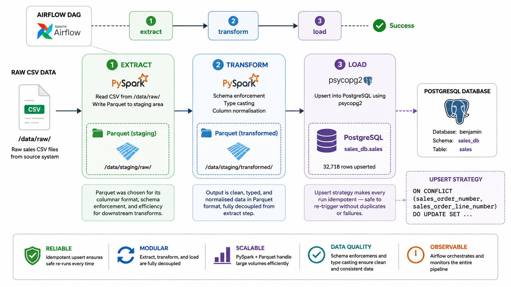

# Sales ETL Pipeline


End-to-end sales data pipeline built with PySpark, Apache Airflow, and PostgreSQL, fully containerised with Docker Compose.

---

## Data Pipeline



---

## ETL Workflow

### Extract
- Reads raw sales CSV data using PySpark.
- Stores data in a Parquet staging layer for efficient downstream processing.
- Ingests 32,718 sales records.

### Transform
PySpark applies:
- Data type enforcement and casting:
  - `Quantity` → Integer
  - `SalesOrderLineNumber` → Integer
  - `OrderDate` → Date
  - `UnitPrice` → Float
  - `TaxAmount` → Float
- Column standardisation (`CamelCase` → `snake_case`).
- Date enrichment: `order_year`, `order_month`, `order_day`.
- Writes the cleaned dataset back to a transformed Parquet layer.

### Load
- Reads transformed Parquet data.
- Loads records into PostgreSQL (`sales_db.sales`).
- Uses an UPSERT strategy with `ON CONFLICT` to ensure idempotent loads and prevent duplicate records.

---

## Stack

| Layer | Tool |
|---|---|
| Orchestration | Apache Airflow 3.2.2|
| Processing | PySpark |
| Storage | PostgreSQL |
| Containerisation | Docker Compose |
| Message Broker | Redis |
| Analysis | Jupyter Notebook (`sales_analysis_pyspark.ipynb`) |
| Language | Python 3.13 |

---
## Project structure

```
sales-etl-pyspark/
├── dags/
│   ├── main.py                     # DAG definition
│   └── etl/
│       ├── extract_transform.py
│       └── load_data.py
├── data/
│   ├── raw/
│   └── staging/transformed/
├── spark_session.py
├── sales_analysis_pyspark.ipynb
├── Dockerfile
├── docker-compose.yaml
└── requirements.txt
```
---
